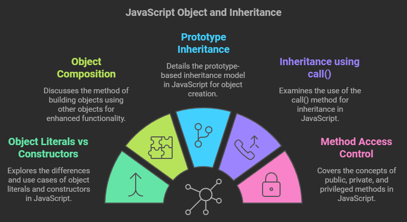

# JavaScript Objects and Inheritance: A Comprehensive Guide



## Table of Contents

1. [Object Literals vs Object Constructors](#object-literals-vs-object-constructors)
2. [Object Composition](#object-composition)
3. [Prototype Inheritance](#prototype-inheritance)
4. [Inheritance using call()](#inheritance-using-call)
5. [Constructor vs Prototype Inheritance](#constructor-vs-prototype-inheritance)
6. [Public, Private, and Privileged Methods](#public-private-and-privileged-methods)

## Object Literals vs Object Constructors

### Object Literals
**Description:**
Object literals provide a way to create single, unique objects in JavaScript. They are best suited when you need to create one-off objects with specific properties and methods. Object literals are created using the curly brace syntax `{}` and all properties and methods are defined directly within the object.

**Example:**
```javascript
const person1 = {
    name: "John",
    age: 30,
    greet() {
        return `Hello, I'm ${this.name}`;
    }
};
```

### Object Constructors
**Description:**
Object constructors act as templates for creating multiple similar objects. They are defined as functions and used with the `new` keyword to create instances. This approach is more suitable when you need to create multiple objects with similar properties and behaviors.

**Example:**
```javascript
function Person(name, age) {
    this.name = name;
    this.age = age;
}

Person.prototype.greet = function() {
    return `Hello, I'm ${this.name}`;
};

const person2 = new Person("Alice", 25);
const person3 = new Person("Bob", 35);
```

## Object Composition

**Description:**
Object composition is a design pattern where complex objects are built by combining simpler, independent objects. This approach promotes modularity and code reuse by allowing objects to contain instances of other objects as properties.

**Example:**
```javascript
class Wheel {
    constructor(size) {
        this.size = size;
    }
}

class Engine {
    constructor(type) {
        this.type = type;
    }
    
    start() {
        return `${this.type} engine started`;
    }
}

class Car {
    constructor(model, type) {
        this.model = model;
        this.engine = new Engine(type);
        this.wheels = Array(4).fill(new Wheel(17));
    }
}

const myCar = new Car("BMW", "V8");
```

## Prototype Inheritance

**Description:**
JavaScript uses prototype-based inheritance, allowing objects to inherit properties and methods from other objects. This mechanism provides efficient memory usage as methods are shared across instances through the prototype chain.

**Example:**
```javascript
function Animal(name) {
    this.name = name;
}

Animal.prototype.makeSound = function() {
    console.log("The animal makes a sound");
};

function Dog(name, breed) {
    Animal.call(this, name);
    this.breed = breed;
}

Dog.prototype = Object.create(Animal.prototype);
Dog.prototype.constructor = Dog;

const myDog = new Dog("Buddy", "Labrador");
```

## Inheritance using call()

**Description:**
The `call()` method provides a way to invoke a function with a specified `this` context and arguments. In inheritance, it's used to call a parent constructor function from within a child constructor, effectively inheriting properties while maintaining the proper `this` binding.

**Example:**
```javascript
function Person(fName, lName, age) {
    this.firstName = fName;
    this.lastName = lName;
    this.age = age;
    this.getFullName = function() {
        return `${this.firstName} ${this.lastName}`;
    };
}

function Employee(fName, lName, age, id, salary) {
    // Inherit properties from Person
    Person.call(this, fName, lName, age);
    
    // Add Employee-specific properties
    this.id = id;
    this.salary = salary;
}

const employee1 = new Employee("John", "Doe", 25, 1, 50000);
console.log(employee1.getFullName()); // "John Doe"
```

## Constructor vs Prototype Inheritance

**Description:**
There are two main ways to implement inheritance in JavaScript: constructor-based and prototype-based. Each has its own use cases and trade-offs.

### Constructor Inheritance
Uses `call()` to copy properties and methods directly to instances. Better for properties that should be unique to each instance.

**Example:**
```javascript
function Parent(name) {
    this.name = name;
    this.greet = function() {
        return `Hello, ${this.name}`;
    };
}

function Child(name, age) {
    Parent.call(this, name);
    this.age = age;
}

const child1 = new Child("Alice", 10);
```

### Prototype Inheritance
Uses prototype chain to share methods across instances. Better for methods that should be shared among all instances.

**Example:**
```javascript
function Parent(name) {
    this.name = name;
}

Parent.prototype.greet = function() {
    return `Hello, ${this.name}`;
};

function Child(name, age) {
    Parent.call(this, name);
    this.age = age;
}

Child.prototype = Object.create(Parent.prototype);
Child.prototype.constructor = Child;

const child2 = new Child("Bob", 12);
```

**Comparison:**
```javascript
// Constructor Inheritance:
// Pros:
// - Direct property access
// - Simpler to understand
// - Better for instance-specific methods
// Cons:
// - More memory usage (methods copied to each instance)
// - No shared methods between instances

// Prototype Inheritance:
// Pros:
// - Memory efficient (methods shared via prototype)
// - Better for shared methods
// - True inheritance chain
// Cons:
// - More complex setup
// - Requires understanding of prototype chain
```

## Public, Private, and Privileged Methods

**Description:**
JavaScript provides different levels of method accessibility through closures and the module pattern.

**Example:**
```javascript
function Person(fName, lName, age) {
    // Public properties
    this.firstName = fName;
    this.lastName = lName;
    
    // Private method
    const calculateAge = function() {
        return `Age: ${age}`;
    };
    
    // Privileged method
    this.getInfo = function() {
        return `${this.firstName} ${this.lastName}, ${calculateAge()}`;
    };
}

const person1 = new Person("Ali", "mohammadi", 30);
```

## Best Practices
1. Use object literals for one-off, unique objects
2. Use constructors when creating multiple similar objects
3. Use prototype inheritance for shared methods
4. Use constructor inheritance for instance-specific properties
5. Consider memory usage when choosing inheritance patterns
6. Always restore constructor property when setting up prototype inheritance
7. Use private methods when implementation details should be hidden
8. Document your inheritance patterns for other developers

This guide covers the fundamental concepts of objects and inheritance in JavaScript. Understanding these patterns will help you write more organized, efficient, and maintainable code.